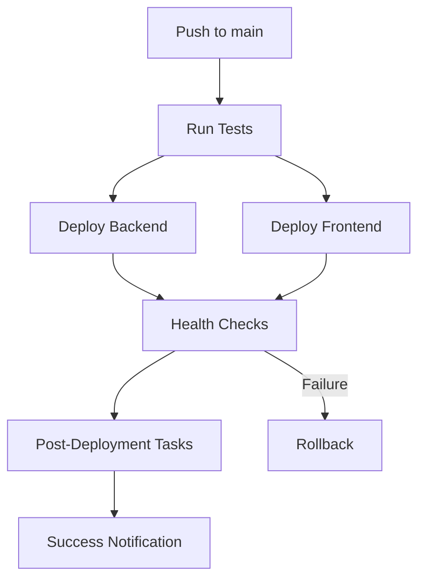

# CI/CD Troubleshooting Guide

This guide helps troubleshoot common issues with the GitHub Actions workflows and deployment pipelines.

## Common Issues

### 1. Vercel Deployment Path Error

**Error Message:**
```
Error: The provided path "~/work/Capstone/Capstone/frontend/frontend" does not exist.
```

**Cause:** Vercel project settings may be misconfigured or the workflow is not linking the project correctly.

**Solution:**
1. Ensure the workflow includes the `vercel link` command before deployment:
   ```yaml
   - name: Pull Vercel Environment Information
     working-directory: ./frontend
     run: |
       vercel link --yes --token=${{ secrets.VERCEL_TOKEN }} --scope=${{ secrets.VERCEL_ORG_ID }}
       vercel pull --yes --environment=preview --token=${{ secrets.VERCEL_TOKEN }}
   ```

2. Verify the `working-directory` is set to `./frontend` in all Vercel-related steps

3. Check that environment variables are properly set in deployment steps:
   ```yaml
   env:
     VERCEL_ORG_ID: ${{ secrets.VERCEL_ORG_ID }}
     VERCEL_PROJECT_ID: ${{ secrets.VERCEL_PROJECT_ID }}
   ```

### 2. Missing Secrets

**Error Message:**
```
Error: Input required and not supplied: token
```

**Solution:**
1. Go to Repository Settings → Secrets and variables → Actions
2. Ensure these secrets are set:
   - `VERCEL_TOKEN`
   - `VERCEL_ORG_ID`
   - `VERCEL_PROJECT_ID`
   - `RAILWAY_TOKEN`

### 3. Railway Deployment Failures

**Error Message:**
```
Error: No project linked
```

**Solution:**
1. Ensure the Railway CLI is installed in the workflow
2. Check that the `RAILWAY_TOKEN` secret is valid
3. Verify you're in the correct directory when deploying:
   ```yaml
   - name: Deploy to Railway
     env:
       RAILWAY_TOKEN: ${{ secrets.RAILWAY_TOKEN }}
     run: |
       cd backend
       railway up
   ```

### 4. Health Check Failures

**Error Message:**
```
Backend health check failed with status 404
```

**Solution:**
1. Verify the health endpoint exists in your backend:
   ```javascript
   app.get('/health', (req, res) => {
     res.status(200).json({ status: 'healthy' });
   });
   ```

2. Ensure the backend URL is correct in the workflow
3. Increase the sleep time before health checks:
   ```yaml
   sleep 60  # Wait longer for deployment to complete
   ```

### 5. Lighthouse CI Failures

**Error Message:**
```
Error: No artifacts were uploaded
```

**Solution:**
1. Ensure the deployment URL is correctly captured:
   ```yaml
   DEPLOYMENT_URL=$(vercel deploy --token=${{ secrets.VERCEL_TOKEN }} --yes --scope=${{ secrets.VERCEL_ORG_ID }})
   echo "deployment_url=$DEPLOYMENT_URL" >> $GITHUB_OUTPUT
   ```

2. Verify the Lighthouse step receives the correct URL:
   ```yaml
   urls: |
     ${{ steps.deploy.outputs.deployment_url }}
   ```

## Debugging Steps

### 1. Enable Debug Logging

Add this to your workflow:
```yaml
env:
  ACTIONS_RUNNER_DEBUG: true
  ACTIONS_STEP_DEBUG: true
```

### 2. Add Echo Statements

Debug variables and paths:
```yaml
- name: Debug Info
  run: |
    echo "Current directory: $(pwd)"
    echo "Frontend contents: $(ls -la ./frontend)"
    echo "Vercel org ID: ${{ secrets.VERCEL_ORG_ID }}"
```

### 3. Check Workflow Syntax

Use the GitHub Actions workflow syntax validator:
```bash
# Install act locally
brew install act

# Validate workflow
act -n -W .github/workflows/deploy.yml
```

### 4. Test Locally

Test deployments locally before pushing:
```bash
# Frontend
cd frontend
vercel deploy --yes

# Backend
cd backend
railway up
```

## Best Practices

### 1. Use Explicit Paths

Always use explicit paths in workflows:
```yaml
working-directory: ./frontend  # Good
working-directory: frontend    # May cause issues
```

### 2. Set Environment Variables

Always set required environment variables:
```yaml
env:
  VERCEL_ORG_ID: ${{ secrets.VERCEL_ORG_ID }}
  VERCEL_PROJECT_ID: ${{ secrets.VERCEL_PROJECT_ID }}
  VERCEL_TOKEN: ${{ secrets.VERCEL_TOKEN }}
```

### 3. Use Output Variables

Capture and pass data between steps:
```yaml
- name: Deploy
  id: deploy
  run: |
    URL=$(vercel deploy --yes)
    echo "url=$URL" >> $GITHUB_OUTPUT

- name: Use URL
  run: echo "Deployed to ${{ steps.deploy.outputs.url }}"
```

### 4. Handle Failures Gracefully

Always include error handling:
```yaml
- name: Deploy with Retry
  run: |
    for i in {1..3}; do
      vercel deploy && break || sleep 30
    done
```

## Workflow Dependencies

Ensure your workflows have the correct dependency chain:



## Getting Help

1. **Check Logs**: Always check the full workflow logs first
2. **Vercel Dashboard**: Check deployment logs at https://vercel.com/dashboard
3. **Railway Dashboard**: Check deployment logs at https://railway.app
4. **GitHub Status**: Check if GitHub Actions is experiencing issues
5. **Documentation**: 
   - [Vercel CLI Docs](https://vercel.com/docs/cli)
   - [Railway CLI Docs](https://docs.railway.app/develop/cli)
   - [GitHub Actions Docs](https://docs.github.com/en/actions)

## Common Commands

### Vercel
```bash
# Link project
vercel link

# Pull environment
vercel pull --yes --environment=preview

# Deploy
vercel deploy --yes

# Deploy to production
vercel deploy --prod --yes
```

### Railway
```bash
# Login
railway login

# Link project
railway link

# Deploy
railway up

# View logs
railway logs
```

### GitHub CLI
```bash
# View workflow runs
gh run list

# View specific run
gh run view <run-id>

# Download artifacts
gh run download <run-id>

# Re-run failed workflow
gh run rerun <run-id>
```
